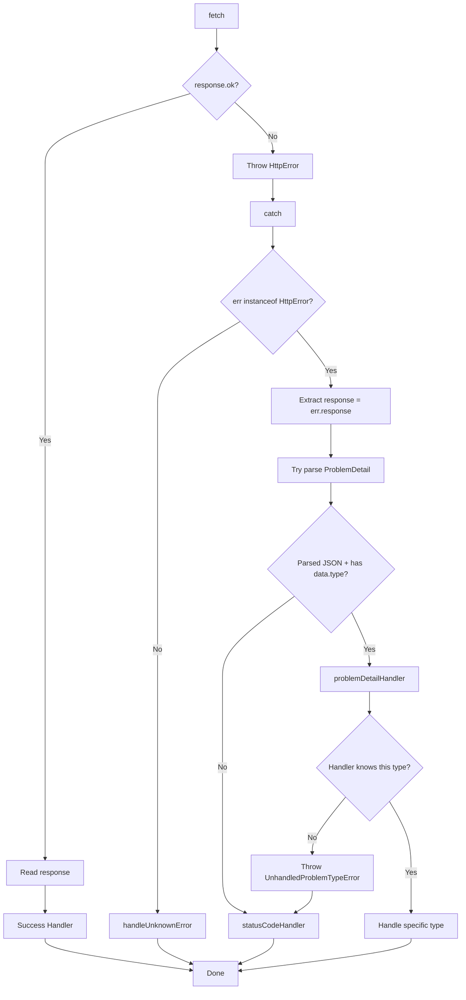

# Error Handling
---

Let's map the failure modes that I need to react to in each page:

## Current List Page
* New item form (V)
    * Input validation - name length, positive quantity (V)
    * Invalid values for enums (category/quantity type) (V)
    * Server error (V)

## Products Page
* New product form (V)
    * Input validation - name length (V)
    * Duplicate product (V)
    * Invalid values for enums (V)
    * Duplicate removes (V)

## Fixed List Page
* Negative or 0 value for product (V)
* Product not exists (deleted in other session) (V)
* List removed in other session (V)

## New List Page
* Input validation - name length, empty list
    * In Add list: (V - backend)
    * In Edit list: (V - backend)
* Product not exists (V - backend only)
* Duplicates (V - backend only)

## Tenants page
* Name too short validation

## Manage tenant
* Invite invited user (V)
* Accept/decline cancelled invitation (V)
* 

## Where I am now
Working on the error handling of New fixed list/edit fixed list.
Specifically:
* If a user adds products that were deleted by another user
    * This can happen both in the new list and edit list
* If a user edits a list that doesn't exist because another user deleted it

So the backend is taken care of, now we need to make sure to send a ProblemDetail message and display a nice error message in the frontend.

### Leftovers
* In edit fixed lists: if a user removes all products from a list, we may want to throw an error.

  
---
# Startegy

Our strategy for handling errors in form submitting is as follows: First, we submit the forms using JavaScript `fetch`. Then, in the frontend, we follow the following pattern:

