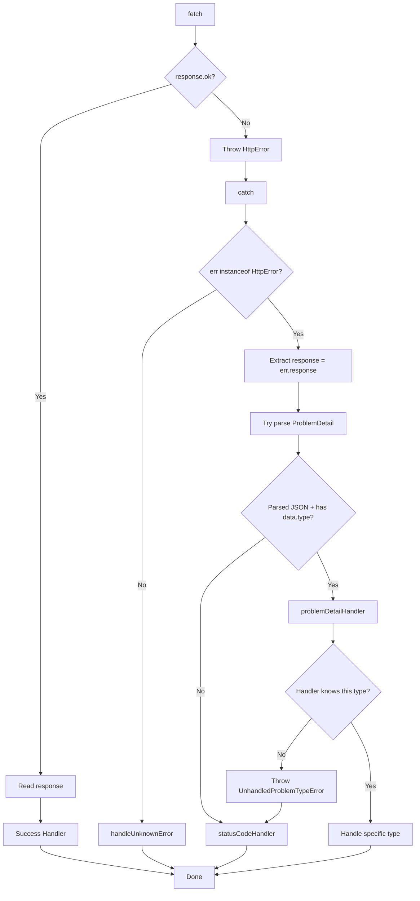

# Error Handling
---

Let's map the failure modes that I need to react to in each page:

## Current List Page
* New item form
    * Input validation - name length, positive quantity
    * Invalid values for enums (category/quantity type)

## Products Page
* New product form
    * Input validation - name length
    * Duplicate product
    * Invalid values for enums

## Fixed List Page
* Negative value for product
* Product not exists (deleted in other session)
* List removed in other session

## New List Page
* Input validation - name length, empty list
* Duplicates

  
---
# Startegy

Our strategy for handling errors in form submitting is as follows: First, we submit the forms using JavaScript `fetch`. Then, in the frontend, we follow the following pattern:

```mermaid
  flowchart TD
  A[fetch] --> B{response.ok?}

  B -- Yes --> C[Read response]
  C --> D[Success Handler]
  D --> Z[Done]

  B -- No --> E[Throw HttpError]
  E --> F[catch]
  F --> G{err instanceof HttpError?}

  G -- No --> H[handleUnknownError]
  H --> Z

  G -- Yes --> I[Extract response = err.response]
  I --> J[Try parse ProblemDetail]
  J --> K{Parsed JSON + has data.type?}

  K -- No --> L[statusCodeHandler]
  L --> Z

  K -- Yes --> M[problemDetailHandler]
  M --> N{Handler knows this type?}

  N -- Yes --> O[Handle specific type]
  O --> Z

  N -- No --> P[Throw UnhandledProblemTypeError]
  P --> L

```